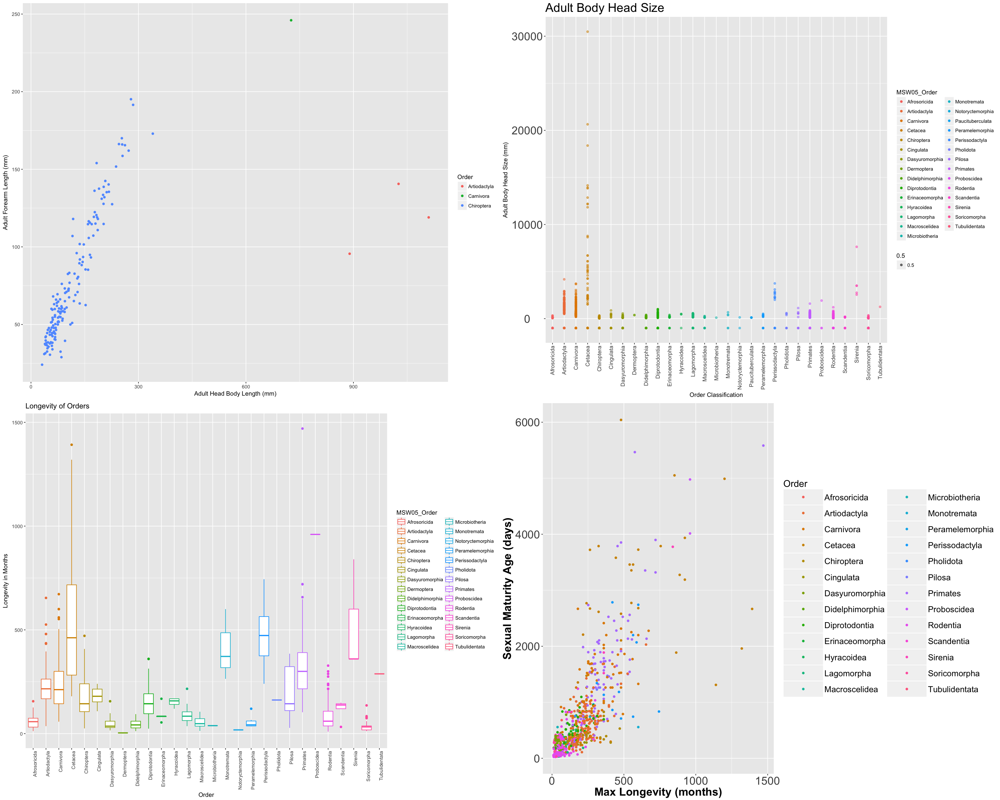

#**Introduction**
This is our R Notebook, showing the steps we took to complete Project2 for CS 329E. This notebook includes step-by-step instructions on how to reproduce our project. To obtain our data, we used esapubs.org, an online ecological archive containing data sets on analyses of life history, ecological, and geographic trait differences among species. In this project, we analyze the information on traits to look at patterns among orders and species. 

#**R Configuration**
Below we display our sessionInfo().

```{r sessionInfo}
sessionInfo(package=NULL)
```

#**The Data**
All data were obtained through esapubs.org. The dataset, Pantheria, contains 100740 lines of biological data for extant and recently extinct mammalian species and was collect over a span of three years. All data came as one textfile, which we edited using Microsoft Excel.

```{r}
source("../01 Data/Access Dataworld dv2.R")
```

#**Visualizations**
**Adult Forearm Length vs. Adult Head Body Length:** A visualization comparing the correlation between forearm length of adult species (in mm) to head body lengths (in mm) across various orders.

**Adult Body Head Size:** A visualization showcasing the adult body head sizes (in mm) of various orders.

**Longevity of Orders:** A visualization showcasing the length of lifespans (in months) for various orders.

**Sexual Maturity vs. Max Longevity:** A comparison between the age of sexual maturity (in days) of various orders to their maximum longevity (in months).

</center>

```{r}
source("../03 Visualizations/dv project2 plots.R")
```
